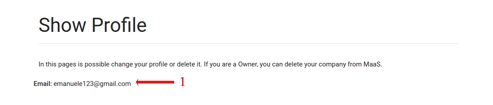
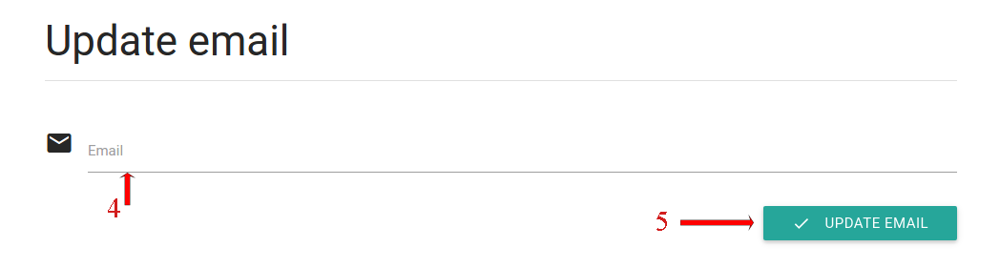

# Authentication and profile management
## Registration
The first step for using MaaS is signing up by clicking on the *Sign up* button on the homepage. You will be redirected to a page containing a form which should be filled out with an email address, a password and the name of the company. Then you can continue by clicking on the *Sign up* button.

## Authentication
Registration is required for logging in. Login allows you to access the system dashboard and all the features offered by MaaS. In order to authenticate you must fill out the form available on the homepage. As illustrated in figure below , you will be asked to enter an e-mail (1) , a password (2) and click on the *Sign in* button (3). When this operation has been completed, the user is redirected to the *Dashboard* page.

## Password recovery
In case the user has lost his/her password, it's possible to recover the password. You need to know your registration email in order to proceed. Click on the *Forgot your password?* link on the login screen to start the recovery procedure.
You will have to fill out a form. In this form you should insert your registration email and click on the *Reset Password* button. An email containing more instructions will be sent to the previously inserted address.

## Access and change personal profile
In order to access the profile's edit page, click on the email address on the menu bar and select *Profile*. Here the user can modify his/her email address and password.
The first section shown is the **Show Profile** section. Here you can see your email (1).

You can also change your email address or your login password clicking on *CHANGE EMAIL* (2) or *CHANGE PASSWORD* buttons on the **Edit profile** section. In both cases you will see a simple form which allows to you to change the selected data. In particular, the *CHANGE EMAIL* form will be the following:

Here you can insert your new email address (4). Click on **UPDATE EMAIL** (5) in order to update your email address.
The password updating is more or less the same. Here you have to insert your old password (6) and the new password, two times (7 - 8) to be sure that there aren't errors in your typing. Againg, click on the **UPDATE PASSWORD** button (9) to change you password.

Finally, you can delete your own profile by clicking **DELETE PROFILE**. In order to delete your profile, you have to confirm your email address. The remotion isn't reversible, so please pay attention and be sure of that.
