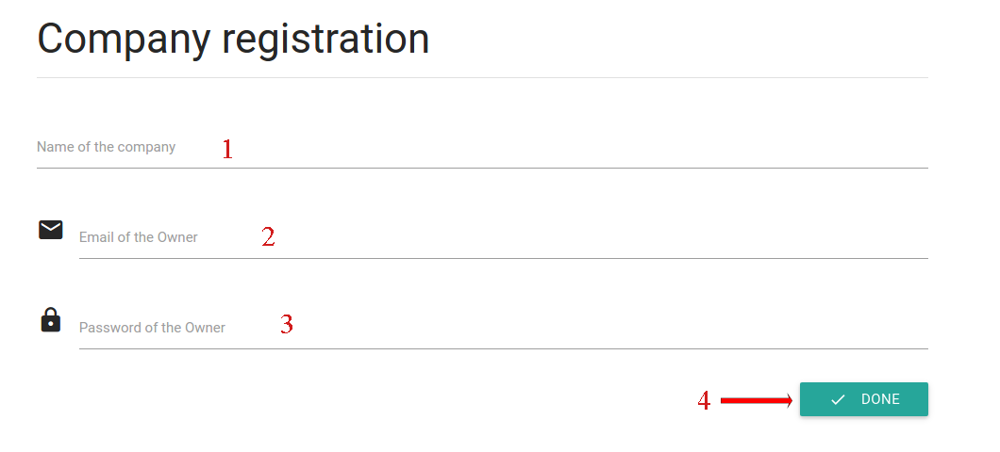

## Company registration
The company registration is the only page that does not require authentication. In order to register a new company, click on the *Company Registration* button of the menu bar at the top of the home page. You will see a form which will allow you to register a new company. The required fields are the name of the company and the owner data, in particular email address and password.

This will create a new company and will register the user as the new owner of that company. After that, for the owner will be posssible to start adding and inviting users and usign MaaS.
