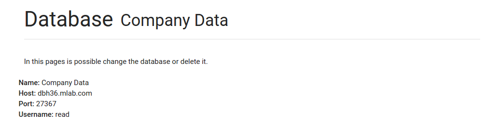

#Database management
##Database list
In the main page of the database management section you can see the list of the databases of your company (1). You can view the configuration of one database, and edit it, in the **Details** button (2) or add a new one (3).

##Database details
A click on the **Details** button of a database will redirect you to the configuration page of the database. Here you can view the details of the configuration.

In this page you can also edit the configuration or delete the database (see the next two sections). Please take note that the deletion of a database from MaaS will not affect the original database.

##Update database
A click on the **UPDATE DATABASE** (1) will redirect you to the edit page. 

In this page you will see a form in which you can specify the configuration of your database. The required fields are the *Name* (1), *Host* (2), *Port* (3), *Username* (4) and *Password* (5). The first three fields are about the database and the last two are about the user used to read the data from the database. The user can be a read only user. Infact a MaaS user can only view the data of a company database. Data writing is not allowed. Finally, click on the **UPDATE DATABASE** button (6). 

##Delete database
In order to delete a database you have to confirm it by inserting the name of the database (1). Then, click on the **DELETE DATABASE** button (2).

##Add a new database
Clicking **ADD NEW DATABASE** you will be redirected to another page and you can add a new database. The fields are the same described for the database editing. Finally, click on the **ADD DATABASE** button (6). 

