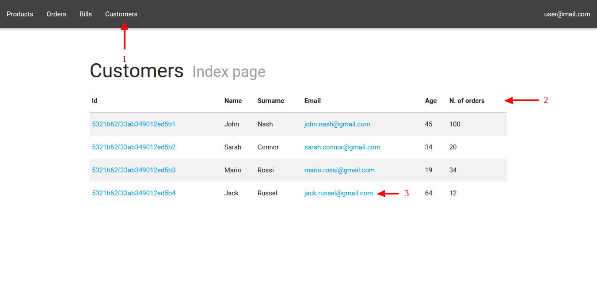

# Collection management

## Dashboard display

## Opening collection index
The collection index page displays the contents of a collection in a table. To open a collection index (see Figure 3) you need to click on the link present in the menu bar (1) , MaaS will show the entire contents of the collection (2). This table displays all the documents you can open ( see 3.3 ) by clicking on the related links (3).

## Opening the show-page of a document
The show-page of a document G displays the document's attributes in tabular form . For
access a show page you need to position yourself in the collection G index of belonging ( see
3.2 ) and follow step 3 .

## Display show page attributes grafted
The presence of grafted document is highlighted by the display attribute as
a link through which you can access to the show page.
