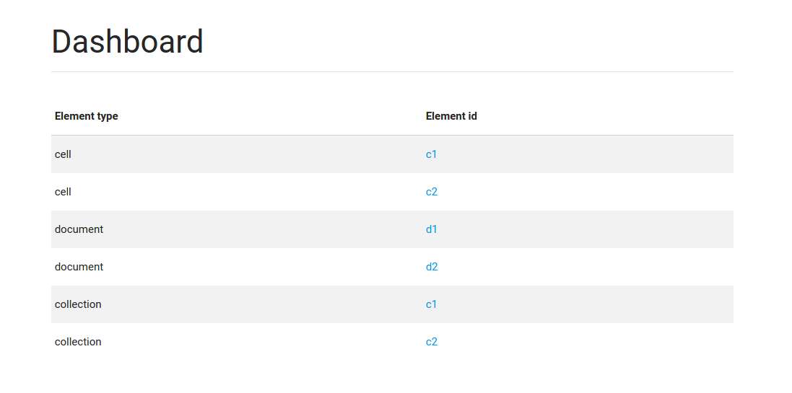
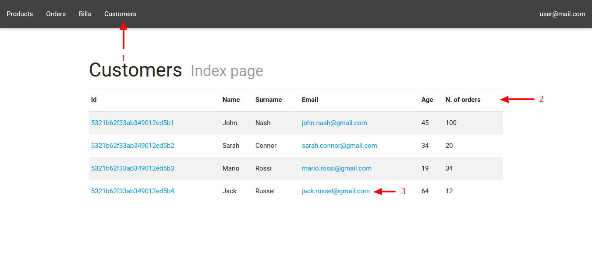
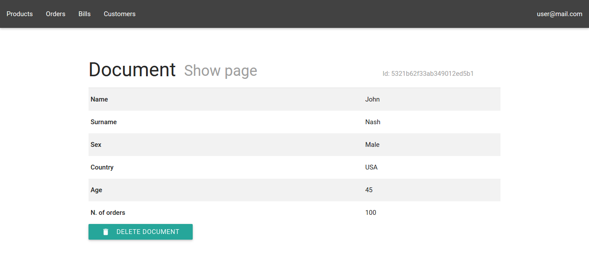

# Collection management
## Displaying/Viewing the dashboard
The dashboard is the main page from which you can have access to the list of collection in the system and other features. To enter you must be authenticated.

## Opening collection index
The collection index page displays the contents of a collection in a table. To open a collection index (see Figure 3) you need to click on the link present in the menu bar (1), MaaS will show the entire contents of the collection (2). This table displays all the documents you can open by clicking on the related links (3).

## Opening the show-page of a document
The show-page of a document displays the document's attributes in a table. For accessing a show-page you must be in the index of the collection the show page belongs and follow step 3.

## Display show page attributes grafted
The presence of grafted document is highlighted by the display attribute as a link through which you can access to the show page.
