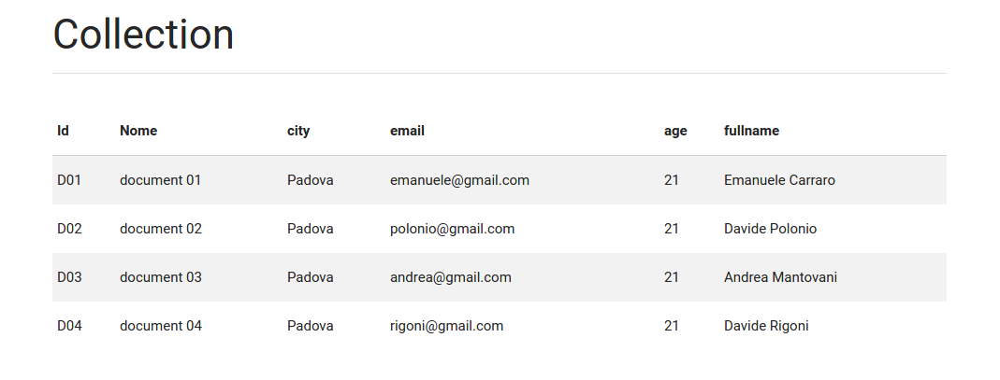
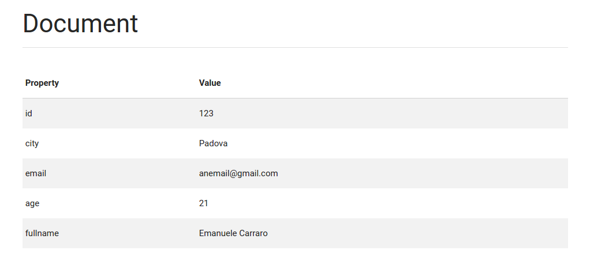
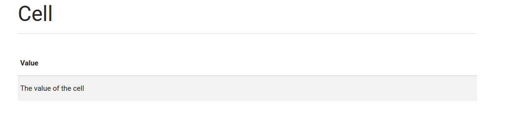

# Dashboard

## Displaying the dashboard
The *Dashboard* is the main page from which you can have access to the list of collection in the system and other features. To see it you must be authenticated.

From the dashboard you can view your cells, documents and collections. Clicking the ID of the element you will see the value of that element. There are three types of element: cell, document and collection. They are shown in different ways depending on their type. These pages will be desribed below.

## Collection

A click on the collection ID will redirect you to the collection page. Here you will see a list of the documents contained in the selected collection. In addition to the document name are shown the properties (and their value) of the selected document.

## Document

A click on the document ID will redirect you to the show-page of a document. The show-page of a document displays the attributes of a document in a table. For each property is shown the corresponding value.

## Cell

The cell is the most simple element of the dashboard. A click on the cell ID will redirect you to the cell page, and you will see only its value.
