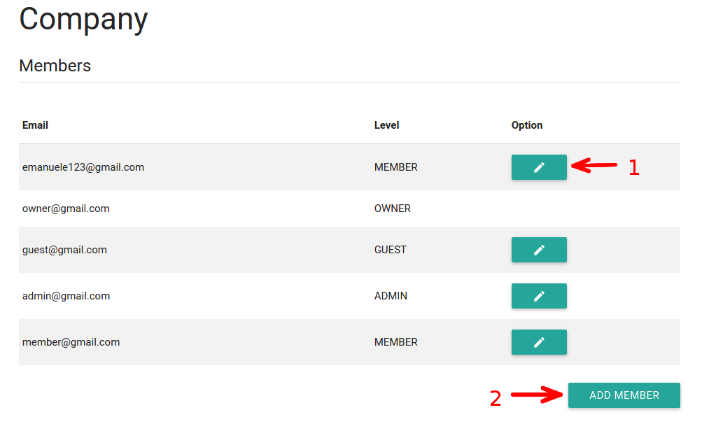
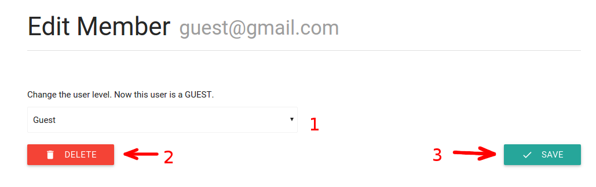

# Members management
##View member list
The main page of the member management section is the full list of the company members. In this page you can see all the members of your company. In particular will be displayed, for each member, the email address and hisher level (Guest, Member, Admin or Owner). You can edit the level of the members of your company by clicking the edit button (1). You will be redirected to the edit member page.

You can also add a new member to your company. Click the **ADD MEMBER** (2) button to do this.

##Edit member
In this page you can modify the level of the selected member of your company. Simply choose the new level (1) and then click **SAVE** (3). You can also delete the memeber clicking the **DELETE** button (2).

##Add member
This page is accessible only to the company administrators by clicking on *Add member* button in the menu.
In order to add a member you must fill out the form available in the page. As illustrated in the figure below , you will be asked to enter an e-mail (1), the level (2) and click on the **ADD MEMBER** button (3). When this operation has been completed, the admin is redirected to the *Dashboard* page.

